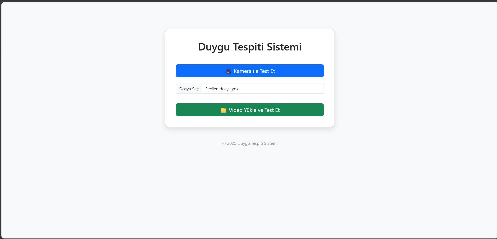

# 3D CNN ile **Computer Vision** ve Duygu Tanıma (Emotion Detection)

Bu proje, **Python** ve  **Computer Vision**  tekniklerini kullanarak video verilerinden yüz ifadelerinden duygu tespiti yapmaktadır.  

Proje iki ana aşamadan oluşmaktadır:

1. **Video veri setlerinden yüzlerin çıkarılması ve ön işleme**  
2. **3D CNN (Convolutional Neural Network) ile duygu sınıflandırması**

---

## 🚀 Özellikler
- **6 farklı duygu sınıflandırması**: `anger, disgust, fear, happiness, sadness, surprise`
- **MTCNN ile yüz algılama ve ROI (Region of Interest) çıkarma**
- **3D CNN tabanlı model** ile video sekanslarından duygu analizi
- Eğitim sonrası model (`.h5`) ve etiketlerin (`.npy`) kaydedilmesi
- Eğitim süreci doğruluk grafikleri
- Kullanılan teknolojiler: **Python**, **NumPy**, **OpenCV**, **TensorFlow**, **facenet-pytorch**

---

## 📸 Örnek Görüntü


## 📸 Web Uygulaması Örneği

Flask uygulaması çalışırken tarayıcıda duygu tahmini:



---

## 🧠 Veri Hazırlama ve Yüz Çıkarma

1. **Video Okuma**:  
   Her video dosyası OpenCV ile kare kare okunur.

2. **Gri Tonlama ve Yeniden Boyutlandırma**:  
   - Her kare gri tona çevrilir.  
   - Kareler 16x16 boyutuna yeniden boyutlandırılır.

3. **MTCNN ile Yüz Algılama**:  
   - **Face Detection**: Her karedeki yüz ROI tespit edilir.  
   - Algılanan yüzler, modelin giriş boyutuna göre kırpılır ve normalize edilir.

4. **Sekans Oluşturma**:  
   - Videolar 10 karelik ardışık sekanslara bölünür (`SEQ_LEN=10`).  
   - Bu sekanslar 3D CNN’e giriş olarak verilir.

---

## 🧠 3D CNN Model Eğitimi

- **Model Mimarisi**:
  - **Conv3D + MaxPooling3D** katmanları ile zaman ve mekansal özellikleri çıkarır.  
  - **Flatten + Dense + Dropout** katmanları ile duygu sınıflandırması yapılır.  
  - Çıkış katmanı **softmax** aktivasyonu ile 6 sınıfa duygu tahmini yapar.

- **Veri İşleme ve Normalizasyon**:
  - Tüm giriş verileri **z-score** ile normalize edilir.  
  - Kategorik etiketler **one-hot encoding** ile hazırlanır.

- **Eğitim Parametreleri**:
  - Loss: `categorical_crossentropy`
  - Optimizasyon: **Adam** (lr=0.0005)
  - Batch Size: 4
  - Epoch: 30
  - Class balancing: `class_weight`
  - Callbacks: `EarlyStopping` & `ModelCheckpoint`

- **Model Çıktısı**:
  - `3dcnn_emotion_model.h5` → Eğitilmiş model
  - `emotion_labels.npy` → Etiketlerin kaydı
  - Eğitim geçmişi `.csv` ve doğruluk verileri `.npy` olarak kaydedilir

---

## ⚙️ Flask Uygulaması ile Gerçek Zamanlı Duygu Tahmini

- **Kamera veya Video Yükleme**:
  - `/camera` → Canlı kamera akışı üzerinden tahmin
  - `/upload` → Video dosyası yükleyerek tahmin
- **Tahmin Süreci**:
  1. Kareler MTCNN ile yüz tespitinden geçer
  2. 10 karelik sekanslar 3D CNN modeline verilir
  3. Her yüz için en olası duygu ve güven skoru gösterilir

---

## ⚙️ Kurulum

### 1. Gerekli kütüphaneler
```bash
pip install flask opencv-python tensorflow facenet-pytorch matplotlib scikit-learn pandas
